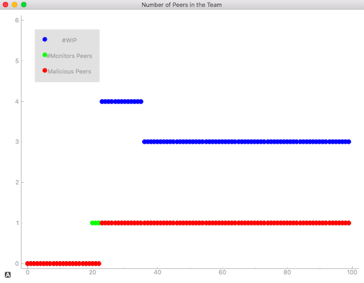
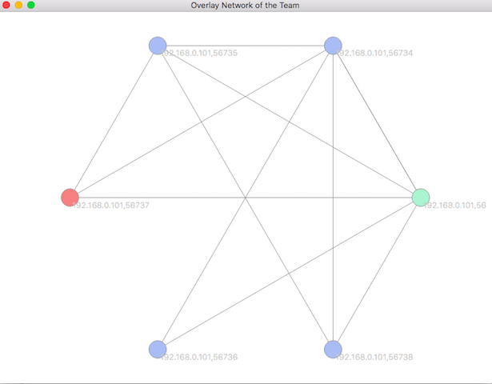
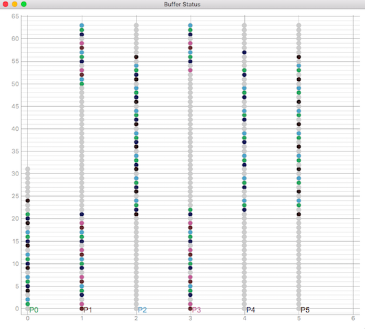

# Google Summer of Code 2018 with [P2PSP](p2psp.org)

# Enhacements to the P2PSP Simulator

**Name: Sachin Singh**

**Email: sachinsngh165@gmail.com**

**Github: [https://github.com/sachinsngh165](https://github.com/sachinsngh165)**

**Mentors: Cristobal Medina-López and Jose Manuel García Salmerón**

**Project: [P2PSP Simulator](https://github.com/P2PSP/simulator/)**

## Abstract
During this GSOC period, I've worked with P2PSP. The P2PSP is an application layer protocol for the real-time streaming of multimedia content over the Internet, i.e., where the users playback the stream in a synchronized way. My project was to make enhancements to the P2PSP simulator. P2PSP simulator aims to give visualization for p2psp protocols and visualize the peers interaction within a team, which would make the testing easier and convenient. Since production code was in C++ (which is super fast), even a small modification in codebase can be very hectic. But having a simulator, we can first test this modification in the simulator and if it is found to be working then we can easily implement this in production code.

## What have been done
Two main milestones were, to :
* Redesign interprocess commnication so that multiple host can communicate
* Optimise plotting speed

### 1. Redesigned Interprocess Communcation(IPC)
Earlier, Unix sockets were being used, and communication was restricted within the host system. My task was to use Intenet sockets in place of Unix sockets so that multiple hosts can communicate and implementation become similar to that of production code, which in turn made the testing quite easier. That's required to re-design the whole communication mechanism and have been done.

### 2. Optimed Plotting Method 
For our visualization task we have required a fast plotting method that can plot in real-time, Matplotlib was unable to fulfill that requirement. That's why we needed a better alternative and PyQtGraph was seems to be a fit. So I've implemented all the plotting method using PyQtGraph. Designing a network overlay was quite challenging as we need to handle clusters of the node. Also plotting buffer status was the most tedious and time-consuming task. In fact, buffer status was the bottleneck of the plotting speed, since lost of points were need to be updated. After doing many optimizations the plotting speed was increased about 150% compared to the previous implementation. 

#### GUI:
#### Team Status 

#### Network Overlay

It shows how the network overlay evolves during the simulation.

**Nodes** represent the following entities:

- green: monitor/trusted peer (M/TPs)
- blue: regular peer (WIPs)
- red: malicious peer (MPs)

#### Buffer status

Buffer status for each peer. Each point in the chart represents a chunk in the buffer of a peer:

- black: chunk from the splitter.
- gray: chunk consumed.
- others: chunk from other peers. One different color for each peer.
 

#### Lost chunk Ratio

### What left
The main milestones have been achieved but following functionalities still to be added:
1. Add a playback control
2. Option to select color map for peers

## What I've learned
This GSOC was an extremely enlightening and fun experience. While working on this project I've improved my problem solving and designing skills. My both of the mentors Cristobal Medina-López and Jose Manuel García Salmerón helped me throughout this period and were giving me constant feedback. I'm very thankful to both of the them. I think contributing to open source is the best way to sharpen your skills and I wish to continue my contribution.

## Commits and pull request
[https://github.com/P2PSP/simulator/commits?author=sachinsngh165](https://github.com/P2PSP/simulator/commits?author=sachinsngh165)

[https://github.com/sachinsngh165/PyQtGraph-Experiments/commits/master](https://github.com/sachinsngh165/PyQtGraph-Experiments/commits/master)

## Issues raised and bugs detected
[https://github.com/P2PSP/simulator/issues/36](https://github.com/P2PSP/simulator/issues/36)

[https://github.com/P2PSP/simulator/issues/31](https://github.com/P2PSP/simulator/issues/31)
